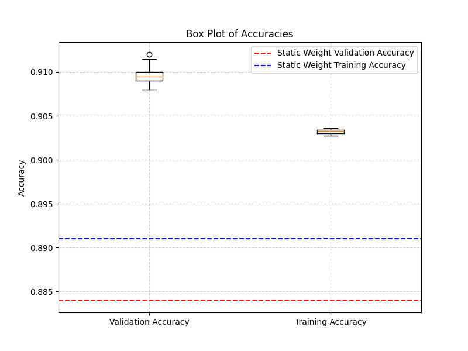
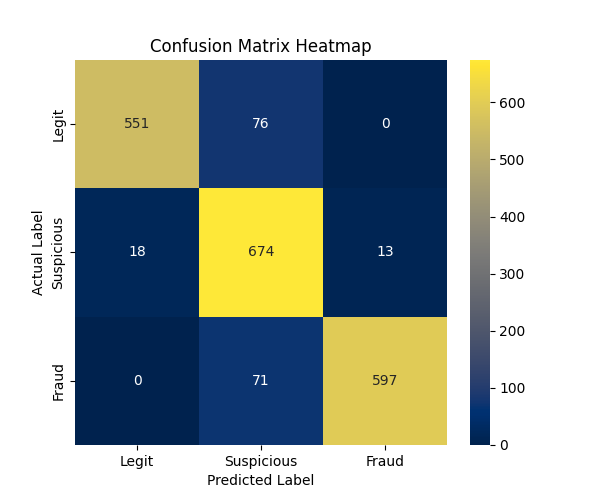
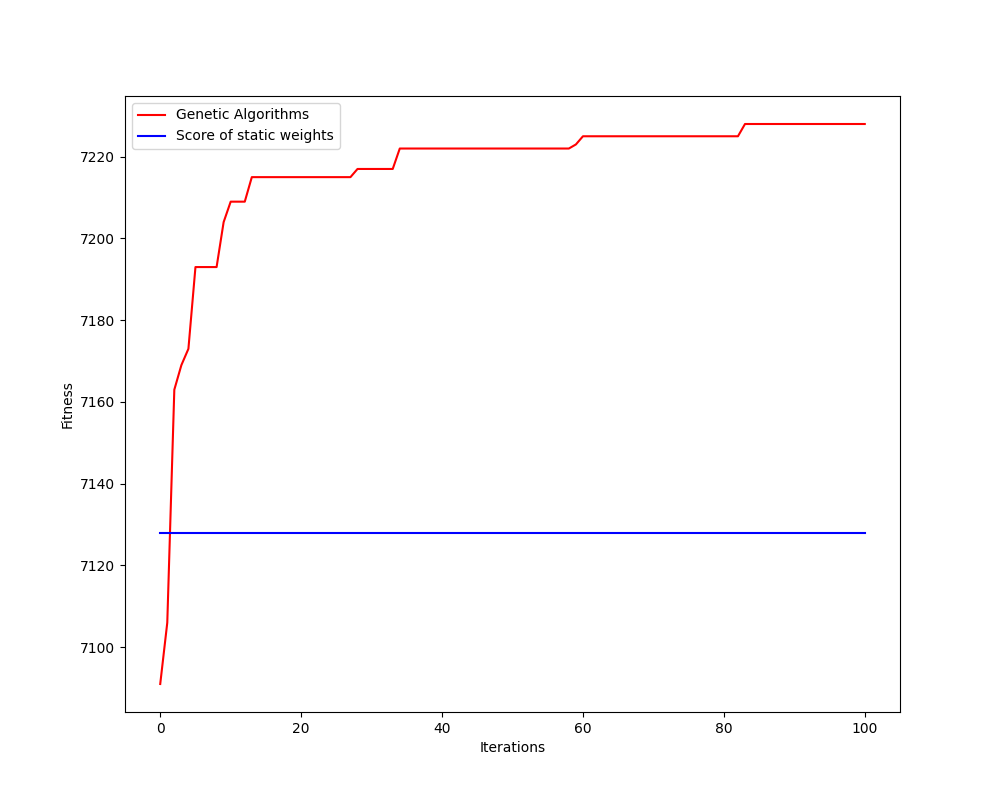

<<<<<<< HEAD
# GA-Based-Classifier
A Basic Ternary Classification Model based on Genetic Algorithm that fine-tunes weights in a weighted sum classification model. 
=======
<<<<<<< HEAD
# GA-Based-Classifier
A Basic Ternary Classification Model based on Genetic Algorithm that fine-tunes weights in a weighted sum classification model. 
=======
<<<<<<< HEAD
# GA-Based-Classifier
A Basic Ternary Classification Model based on Genetic Algorithm that fine-tunes weights in a weighted sum classification model. 
=======
# Ternary Classification Framework Using Genetic Algorithm

This project implements a simple yet effective **ternary classification model** where decisions are made based on a weighted sum of input features. To enhance classification performance, a **Genetic Algorithm (GA)** is used to fine-tune the feature weights. The GA evolves a population of weight vectors through selection, crossover, and mutation, optimizing them to minimize classification error across three distinct classes.

This framework is ideal for problems where linear decision boundaries can be improved through adaptive weight optimization, without the need for gradient-based methods. After optimizing the weights, the model classifies data based on its net score and relative position within the threshold range, making it applicable to more than just ternary classification.

## Classification Logic

The classification mechanism uses the following thresholds:

- `THRESHOLD_L = 30`: Scores below this are classified as **legitimate (0)**
- `THRESHOLD_H = 70`: Scores above this are classified as **fraudulent (2)**
- Scores between 30 and 70 are classified as **suspicious (1)**

This ternary classification scheme segments the input data into three distinct risk categories based on the computed `risk_score`.

## Datasets

To benchmark the model, three datasets with increasing variance values are provided. The datasets are stored in the following directories:

- `datasets/Auth_Var_4/`
- `datasets/Auth_Var_5/`
- `datasets/Auth_Var_6/`

Each dataset consists of JSON files containing authentication-related information, including:

- Geolocation  
- Device Posture  
- Device Binding  
- User Behavior Patterns  
- Login History  
- Network Security  
- Real-Time Threat Data  
- User Behavior Analytics  

Each data instance includes a label indicating the threat level: **level 0** (legitimate), **level 1** (suspicious), or **level 2** (fraudulent).

## Experiment Configurations

The experiment consists of three sub-experiments, each with different population sizes and iterations:

- **Experiment A**: Population size 20, Iterations 50
- **Experiment B**: Population size 50, Iterations 100
- **Experiment C**: Population size 100, Iterations 200

For example, **Experiment Var-5-B** refers to the configuration where the algorithm is run on a dataset with variance value 5 and follows configuration B (population size 50, iterations 100).

## Compilation & Execution

To compile and run the program, use the following command:

```
g++ main.cpp -lpython3.12 -I/usr/include/python3.12/ -I/home/rapidfire69/.local/lib/python3.12/site-packages/numpy/_core/include
```

This command will execute the Genetic Algorithm multiple times across the datasets and generate output JSON files that can be used for statistical analysis.

## Analysis Tools

The repository includes scripts and files to analyze the model's performance through the following:

- **Confusion Matrices**
- **Convergence Graphs**
- **Box Plots**

These tools enable a detailed evaluation of classification accuracy, optimization progress, and cross-dataset consistency.

### Example Outputs from Experiment 5-B:

- **Box Plot**: 
- **Confusion Matrix**: 
- **Convergence Line Graph**: 

>>>>>>> b3eadc7 (Initial commit with project files)
>>>>>>> b1b2c40 (Initial commit)
>>>>>>> 122a0d6 (Initial commit)
